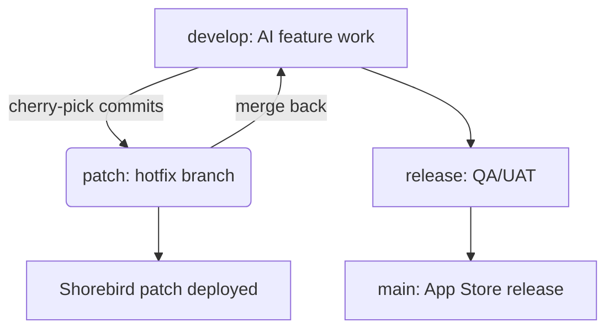

# AI + Shorebird Engineering Playbook

> **140,000+ net lines of code shipped in one month** — this workflow is why.\
> AI-driven development + Shorebird’s instant patching = unmatched velocity and safety.

---

## 1. Why AI + Shorebird?

- **AI agents** generate features, tests, and fixes daily.
- **Shorebird** applies patches in **minutes over the air** — no app store delays.
- **Shorebird CI (GitHub App)** provides **zero-config CI/CD**: PR triggers → automatic patches.
- **Optional private patch server**: enterprise-level control, smoother rollouts, reduced latency.

We demonstrated this velocity when presenting to the **creator of Flutter** — showcasing **140k+ LOC delivered in one month** with seamless patches.

---

## 2. AI Tools in Active Use

| Tool                | Cost Model               | Strengths & Role                                                      |
| ------------------- | ------------------------ | --------------------------------------------------------------------- |
| **Conductor.build** | \$21/month + Claude sub  | Orchestrates multiple AI agents concurrently for pipelines            |
| **Grok**            | \$40/month premium       | Handles 3.5k-line files; makes minimal diffs for surgical changes     |
| **ChatGPT**         | \$20/month               | General-purpose: deep research, agentic features, canvas mode         |
| **Scout.new**       | \$20–\$100/month         | Scaffolds large features (\~30 mins of full agentic work per session) |
| **Cline**           | \$5–\$50/task (variable) | Urgent chores: themes, linting, small refactors                       |
| **Trae** (in eval)  | TBD                      | Infra/DevOps AI — potential future integration                        |

---

## 3. Benefits of Shorebird CI

- **Zero-config**: Install GitHub App → select repos → open PR.
- **Blazing fast**: Parallel checks, monorepo support, caching.
- **Production-ready**: Auto-patches post-merge with minimal developer input.
- **Seamless UX**: Updates feel like upgrades, not interruptions (bottom sheets, soft prompts).
- **Enterprise hosting**: Optionally host patches privately for regulatory or latency needs.

---

## 4. Version Control Discipline

AI agents modify large codebases — **commit discipline is critical** to ensure safety and speed.

**Key Practices:**

- **Atomic commits**: Each commit is one change only.
- **Selective staging**: Stage only relevant code; keep unrelated changes out.
- **Cherry-pick strategy**: Move only needed commits from `develop` to `patch`.
- **Merge back after patch**: Sync `patch` → `develop` to avoid drift.

This guarantees **safe hotfixes** while AI continues generating features on `develop`.

---

## 5. Branching + Patch Flow

### Branch Roles

- `develop`: Ongoing AI-driven feature development.
- `release`: QA/UAT-ready builds.
- `patch`: Production hotfixes only.
- `main`: Mirrors App Store release.

### Flow Example



### Patch Workflow

```bash
# Identify safe commit
git log develop

# Cherry-pick relevant commit(s) to patch
git checkout patch
git cherry-pick <commit-hash>

# Apply patch
shorebird patch

# Merge patch back into develop to sync
git checkout develop
git merge patch
```

---

## 6. Patch Delivery in Minutes

Before Shorebird: **2–5 day app store delays**.\
Now: **<10 minutes** to patch logic/UI and notify users instantly.

**User experience:**

- Optional updates: Non-intrusive modals.
- Forced updates: Enforced via `minRequired` version in Firebase.

---

## 7. Cost Overview

### Fixed Monthly Costs

| Service         | Monthly Cost  | Notes                          |
| --------------- | ------------- | ------------------------------ |
| Conductor.build | \$21 + Claude | Multi-agent orchestration      |
| Grok Premium    | \$40          | 3.5k-line diffing power        |
| ChatGPT         | \$20          | General-purpose + agentic mode |
| Scout.new       | \$20–\$100    | Scaffolding large features     |

### Variable Costs

| Service | Cost Range    | Use Case                       |
| ------- | ------------- | ------------------------------ |
| Cline   | \$5–\$50/task | Urgent chores, themes, linting |

---

## 8. Meeting With Flutter’s Creator (NCL)

- Demonstrated **AI + Shorebird pipeline** (140k LOC/month).
- Highlighted **instant patching workflow** and **cost efficiency**.
- Discussed roadmap: private hosting, multi-agent orchestration, team adoption.
- Validated as **industry-leading AI engineering approach**.

---

## 9. Roadmap for Adoption

1. **Pilot**: Continue refining AI + Shorebird CI workflow internally.
2. **Expand**: Introduce Trae + additional Cline models (Claude Sonnet-4, MoonshotAI/Kimi-K2).
3. **Private Patch Hosting**: Gain full control and telemetry for enterprise scale.
4. **Company Standardization**: Formalize as **internal AI Engineering Playbook**.

---

## 10. Why This Matters

- **Velocity**: Ship faster than traditional teams (140k LOC/month).
- **User Experience**: Patches feel seamless — upgrades, not interruptions.
- **Cost Efficiency**: AI agents reduce engineering overhead while scaling output.
- **Proven at Leadership Level**: Presented to Flutter’s creator; validated approach.

---

## 11. Quick Reference Commands

```bash
# Start AI-driven development
git checkout develop

# Patch urgent issue
git cherry-pick <commit-hash> # from develop to patch
shorebird patch

# Sync branches
git checkout develop
git merge patch

# Tag release
git tag -a vX.Y.Z -m "Approved AI-generated patch"
git push --tags
```

---
## Before (Writing a prompt myself with no AI assistance)


## After: (Having AI rewrite the prompt and in PDF format, and giving additional instructions for the agent)


